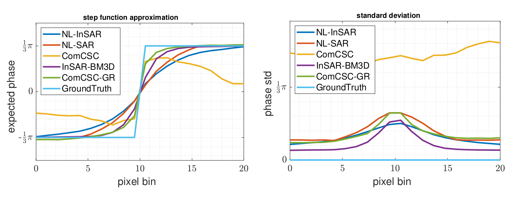

# Learning Convolutional Sparse Coding on Complex Domain for Interferometric Phase Restoration

[Jian Kang](https://github.com/jiankang1991), [Danfeng Hong](https://sites.google.com/view/danfeng-hong), [Jialin Liu](https://www.math.ucla.edu/~liujl11/), [Gerald Baier](https://www.geoinformatics2018.com/member/geraldbaier/), [Naoto Yokoya](https://naotoyokoya.com/), [Begüm Demir](https://begumdemir.com/)

---

This repo contains the codes for the TNNLS paper. we propose a complex convolutional sparse coding (ComCSC) algorithm and its gradient regularized version (ComCSC-GR) for interferometric phase restoration. Our method outperforms the state-of-the-art methods.

**10, 000 Monte-Carlo simulations for evaluating the compared methods on the expected values and standard deviations of step function approximation. The amplitude is constant and the coherence value is set as 0.3.**

